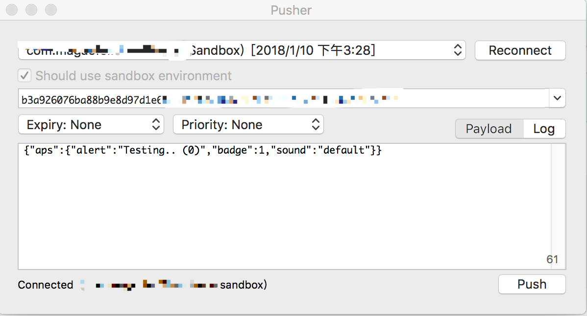

#### 根据推送的通知更改剪贴板的内容

1. 导入证书到电脑

2. 打开并在真机运行项目，允许 App 接收通知, 确保设备打开后台应用刷新

3. 查看 Log面板的 **DeviceToken**

4. 打开[Pusher](https://github.com/noodlewerk/NWPusher) 并输入 DeviceToken，并选择刚刚导入到电脑的证书

5. 输入推送内容

   ```objc
   // 静默推送
   {"aps":{"content-available": 1},"content": "Testing.. (3)"}

   // 普通推送
   {"aps":{"alert":"Testing.. (1)","badge":1,"sound":"default"}}
   ```

6. 点击推送按钮





目前已知：

App必须打开一次，且不能手动清理后台

